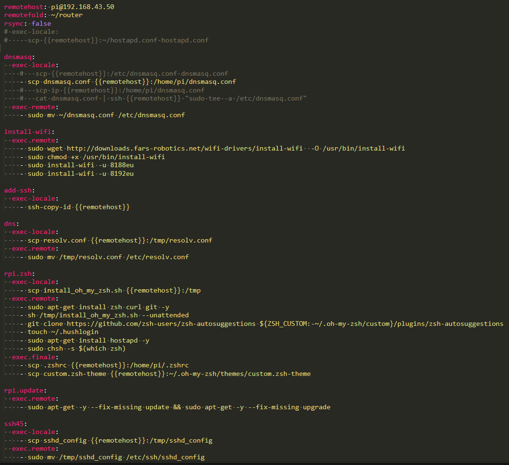

**Install**
```js
npm install -g remotemon
```

`remotemon` is a cli-tool for building/copying/executing code on remote machines and monitoring the result.

It's main application use-case is for developing / running scripts for single-board computers like the raspberry pi ..

.. however it can also be used as as a replacement for `make` / `nodemon` 😀.

```bash
remotemon rpi.update # to update rpi 😎
remotemon dns # to change default dns 🧐
remotemon rpi.zsh # install zsh and get oh-my-zsh on the raspberry pi 😏
remotemon ssh45 # to change default ssh port to 45 👮🏼‍♂️
```

<!--  -->


***When not to use remotemon ?***

- when your build process gets complicated enough to warrant the use of gulpfiles, makefiles, etc.

- `remotemon` is meant for situations where you are constantly having to configure linux system files, but also developing and running code on remote machines, that involves complicated `rsync` and `ssh` commands, but prefer to change those files from the comfort of your favorite local text editor - not everybody has time to learn vim.


#### 🟡 How to Use

`remotemon` operates using `YAML` configuration files ( similar to makefiles ), by default it assumes a file named `.remotemon.yaml` as the configuration file to use.

It searches for  `.remotemon.yaml` in working directory and one folder up ( only ).

Running `remotemon` without any arguments makes `remotemon` execute default routine present in provided configuration file :

```zsh
~/app:(dev*) remotemon
```

`remotemon` accepts arguments which are name(s) of build routines to use, specified through our configuration `.yaml` file.

```zsh
~/app:(dev*) remotemon test1
```

`remotemon` accepts configuration file with different names than `.remotemon.yaml`, using  `--config` flag :

```zsh
~/app:(dev*) remotemon --config ./custom_config.yaml
```

#### 🟡 Creating Configuration `YAML` File

- **Quick Example**

```yaml
  remotehost: pi@192.152.65.12
  remotefold: ~/test
  exec-locale: make local
  exec-remote: make remote
```

```yaml
  remotehost: pi@192.152.65.12
  remotefold: ~/test
  exec-locale: make local
  exec-remote: make remote
  chokidar:                     # chokidar options
    awaitWriteFinish: true
```

```yaml
  remotehost: pi@192.152.65.12
  remotefold: ~/test
  exec-locale: make local
  exec-remote: make remote
  chokidar:
    awaitWriteFinish: true
  rsync:                        # rsync options
    - recursive
    - exclude:
      - .gitignore
      - .ls
      - .git
```

```yaml
  remotehost: pi@192.152.65.12
  remotefold: ~/test
  exec-locale: make local
  exec-remote: make remote
  chokidar:
    awaitWriteFinish: true
  rsync:
    - recursive
    - exclude:
      - .gitignore
      - .ls
      - .git
  test1:                        # custom routine
    remotefold: ~/test1
```


- **Creating named builds**

  Named builds can be created at top-level as long as the name does not clash with selected keywords ( ,`remotehost`,`remotefold`,`exec-locale`,`exec-remote`,`chokidar`,`initialize`,`ssh`,`watch` and `rsync` ).


```yaml
mybuild1:
  remotehost: pi@192.152.65.12
  remotefold: ~/test
  exec-locale: make pi1
  exec-remote: make mybuild1
mybuild2:
  remotehost: pi@192.168.43.51
  remotefold: ~/build
  exec-locale: make pi2
  exec-remote: make mybuild2
```

values not provided in a build are merged with default provided at top-level , in case defaults don't exist at top level then values are extracted from module's internal defaults.

```yaml
rsync:
  - recursive
  - exclude:
    - .gitignore
    - .ls
    - .gi
mybuild1:
  remotehost: pi@192.152.65.12
  remotefold: ~/test
  exec-locale: make pi1
  exec-remote: make mybuild1
mybuild2:
  remotehost: pi@192.152.65.12
  remotefold: ~/build
  exec-locale: make pi2
  exec-remote: make mybuild2
```

In the above config file for example, `mybuild1` and `mybuild2` get their rsync values from the common `rsync` field.

Since rsync's default `src` and `des` are not provided by user in our config file, they are derived from `remotemon`'s internal defaults.

#### 🟡 **all configuration options**

- `remotehost`  - `{username}@{ipaddress}` / ssh name of remote client.
- `remotefold`  - folder in remote client where we want to execute our script.
- `watch`       - local file(s) or folders(s) to watch for changes.
- `exec-locale` - local script to run before copying files to remote client and executing our scripts.
- `exec-remote` - command to execute in remote client.
- `exec-finale` - command to execute after `exec-remote` returns `exit 0`.
- `ssh`         - custom `ssh` config options, default is `-tt -o LogLevel=QUIET`.

- `chokidar`- options to use for  module :
  - `awaitWriteFinish`
    -  `stabilityThreshold`
    - `pollInterval`

  - `persistent`▪️`ignoreInitial`▪️`followSymlinks`▪️`disableGlobbing`▪️`usePolling`▪️`alwaysStat`▪️`ignorePermissionErrors`▪️`atomic`▪️`interval`▪️`binaryInterval`▪️`depth`▪️`ignored`▪️`cwd`

- `rsync` - rsync options ( currently supported ) :
    - `src: .` - source folder(s) to sync.
    - `des: ~/test` - destination folder in remote client.
    - `recursive`▪️`verbose`▪️`quiet`▪️`no-motd`▪️`exclude:`▪️`checksum`▪️`archive`▪️`relative`▪️`no-OPTION`▪️`no-implied-dirs`▪️`backup`▪️`update`▪️`inplace`▪️`append`▪️`append-verify`▪️`dirs`▪️`links`▪️`copy-links`▪️`copy-unsafe-links`▪️`safe-links`▪️`copy-dirlinks`▪️`keep-dirlinks`▪️`hard-links`▪️`perms`▪️`executability`▪️`chmod:`▪️`acls`▪️`xattrs`▪️`owner`▪️`group`▪️`devices`▪️`specials`▪️`devices`▪️`specials`▪️`times`▪️`omit-dir-times`▪️`super`▪️`fake-super`▪️`sparse`▪️`dry-run`▪️`whole-file`▪️`one-file-system`▪️`existing`▪️`ignore-existing`▪️`remove-soucre-files`▪️`del`▪️`delete`▪️`delete-before`▪️`delete-during`▪️`delete-delay`▪️`delete-after`▪️`delete-excluded`▪️`ignore-errors`▪️`force`▪️`partial`▪️`delay-updates`▪️`prune-empty-dirs`▪️`numeric-ids`▪️`ignore-times`▪️`size-only`▪️`compress`▪️`cvs-exclude`▪️`F`▪️`from0`▪️`protect-args`▪️`blocking-io`▪️`stats`▪️`8-bit-output`▪️`human-readable`▪️`progress`▪️`P`▪️`itemize-changes`▪️`list-only`

  - `block-size:`▪️`rsh:`▪️`rsync-path:`▪️`max-delete:`▪️`max-size:`▪️`max-size:`▪️`partial-dir:`▪️`timeout:`▪️`contimeout:`▪️`modify-window:`▪️`temp-dir:`▪️`fuzzy:`▪️`compare-dest:`▪️`copy-dest:`▪️`link-dest:`▪️`compress-level:`▪️`skip-compress:`▪️`filter:`▪️`exclude:`▪️`exclude-from:`▪️`include:`▪️`include-from:`▪️`files-from:`▪️`address:`▪️`port:`▪️`sockopts:`▪️`out-format:`▪️`log-file:`▪️`log-file-format:`▪️`password-file:`▪️`bwlimit:`▪️`write-batch:`▪️`only-write-batch:`▪️`read-batch:`▪️`protocol:`▪️`iconv:`▪️`checksum-seed:`


#### 🟡 `cli` variables

In `make` we can change internal variables (eg.`env`,`file`) from the command line in this way:

```bash
make file=/dist/main.js
make env=prod file=/dist/main.js
make compile env=prod file=/dist/main.js
```
in remotemon the same thing can do done :

```bash
remotemon file=/dist/main.js
```

it changes the internal value(s) of **associated key** in `global`:

```yaml
global:
  file: /dist/main.js # <-- old value replaced with value taken from commandline
remotehost: pi@192.152.65.12
remotefold: ~/test
exec-locale: make local {{global.file}}
exec-remote: make remote
```
string templates can also used to insert value(s) from the command line :

```yaml
remotehost: pi@192.152.65.12
remotefold: ~/test
exec-locale: make local {{file}}
```

however, *it's better practice* to **first** change `global` from your command-line and **then** use `{{global.*}}` to make local edits, since the `global`variable can have default values - something not possible with direct value injections.

this way we can edit the values of our makefile without opening either `.remotemon.yaml` or `makefile` ☺️.

##### 🟡 misc features

- `--no-watch` or `-n` allows to force disable all watches.

- `--dry-run` or `-d` would disable all execution, used for checking and making sure all the commands are accurate.

- `--verbose` or `-v` would show all the command in their full form.

- `rsync:false` disables rsync.


##### 🟡 changelog

`1.1.2`

- custom build accepts array.str ( defaults to `exec-locale` values).

- all `exec.*` changed to `exec-*`

`1.0.0`

- `remotemon` no longer uses a custom parser with `!join` operator, but uses [`tampax`](https://github.com/arthurlacoste/tampa/) ( much ♥️ ) for yaml parsing.

#### LICENCE

- Code released under BSD-3-Clause.
- Documentation and images released under CC BY-NC-ND 4.0.
- details can be found [here](https://github.com/sourcevault/remotemon/blob/dev/COPYING.txt).


